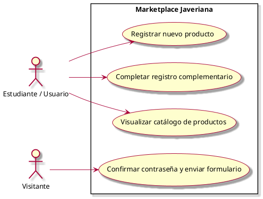

# Casos de Uso

## Diagrama de Casos de Uso

## Listado de Casos de Uso

| #    | Nombre                                                                                                    |
| ---- | --------------------------------------------------------------------------------------------------------- |
| CU01 | [Confirmar contraseña y enviar formulario](casos-de-uso/CU01-Registrar-nuevo-usuario.md) |
| CU02 | [Completar registro complementario](casos-de-uso/CU02-Diseñar-Interfaz-Catalogo.md)               |
| CU03 | [Visualizar catálogo de productos](casos-de-uso/CU03-Diseñar-Formulario-Creacion-Producto.md)                    |

